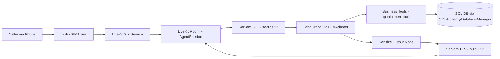
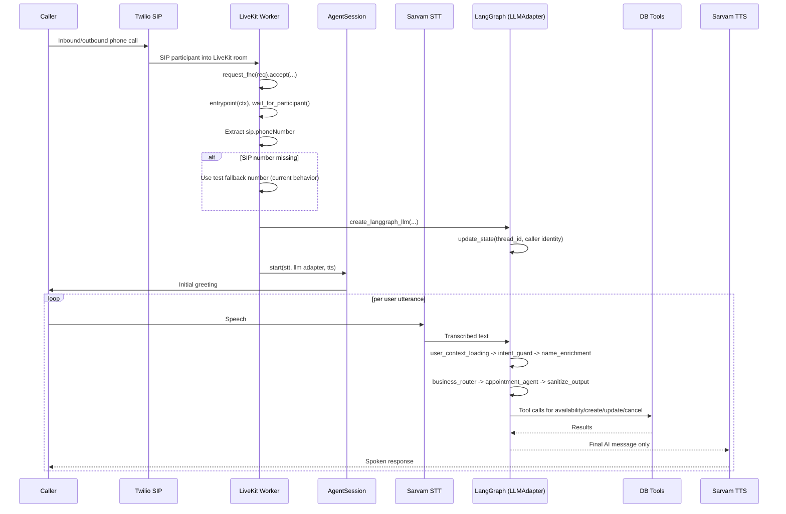

# CTO Voice Agent Technical Dossier

**Project**: Healthcare AI Voice Calling Agent  
**Repository Branch**: `feature/twilio-livekit-integration`  
**Document Date**: February 24, 2026  
**Prepared For**: CTO Review  
**Author**: _TBD_

**Scope**: Backend voice calling agent only (frontend is intentionally excluded except for one testing note).

## 1. Executive Summary
The project implements a deterministic, backend-first voice calling agent for healthcare appointment operations (booking, cancellation, rescheduling) using LiveKit Agents + LangGraph + Sarvam speech services.

Core delivery status as of February 24, 2026:
- Voice orchestration is implemented around LiveKit `AgentSession`.
- Conversational decisioning is implemented as a stateful LangGraph workflow with identity-first and gate-based control.
- Appointment operations are implemented through a tool-backed database layer with validation and transactional flow constraints.
- A supporting FastAPI service exists for operational APIs (voice, appointments, availability, chat, websocket).

Current maturity: strong backend foundation with explicit state and flow guardrails; remaining work is primarily production hardening and cleanup of legacy compatibility surfaces.

## 2. Project Objective and Non-Goals
### Objective
Build a reliable voice calling agent that can safely manage patient appointment transactions over phone-like sessions with deterministic flow control and minimal hallucination risk.

### Non-Goals
- Frontend productization and UX polish are not in scope for this document.
- General-purpose open-ended chatbot behavior is not a target; transactional appointment behavior is the primary objective.

**Frontend note**: a frontend exists in this repository primarily for testing/monitoring workflows and is not a core delivery focus.

## 3. Architecture Overview
### High-Level System Architecture

### Component Responsibilities
- LiveKit worker/session orchestration:
  - Accepts room jobs and starts per-call `AgentSession`.
  - Extracts caller identity from SIP participant metadata.
- Sarvam STT/TTS:
  - STT handles streaming speech-to-text with STT-based turn detection.
  - TTS renders final AI output, with graph-side sanitization to avoid context leakage.
- LangGraph deterministic flow:
  - Identity-first graph entry.
  - Intent guard + name gate + business routing + appointment execution + output sanitization.
- DB tool execution layer:
  - Encapsulates availability checks, create/update/cancel flows, and input validation.
- FastAPI supporting APIs:
  - Operational endpoints for voice status/initiation, availability, appointments, and chat/websocket flows.

## 4. What Has Been Implemented (Completed Work)
The following milestones are implemented in the current branch state.

### 4.1 Migration to LiveKit-Centered Voice Runtime
- Implemented LiveKit worker-driven voice orchestration and per-session voice pipeline.
- Twilio media-stream webhook handling remains only as legacy compatibility surface; active voice architecture is LiveKit + SIP trunking.

Evidence:
- `backend/app/livekit/agent_worker.py`
- `backend/app/apis/voice.py` (`/incoming-call` marked deprecated behavior)
- Commit theme: `e3f5ed7` (voice streaming removal/consolidation), `0dcf005` (job request handler refinements)

### 4.2 Identity-First Graph Entry
- Graph entrypoint is `user_context_loading`, ensuring caller identity resolution before downstream business logic.
- User lookup/create is performed before transactional flow progression.

Evidence:
- `backend/app/ai/graph/workflow.py`
- `backend/app/ai/graph/nodes/user_context_node.py`
- `backend/docs/GRAPH_ARCHITECTURE.md`

### 4.3 Intent Guard with Transactional Intent Locking
- Intent classification occurs early and can lock transactional context (`active_intent`, `intent_locked`, `flow_step`) when confidence threshold is met.
- Locked flows resist accidental reclassification from short follow-ups.

Evidence:
- `backend/app/ai/graph/nodes/intent_detection_node.py`
- `backend/app/ai/graph/state.py`
- Commit theme: `8256715` (intent unlock/flow definition), `1dd95e2` (transactional safety)

### 4.4 Name Gate Blocking Behavior
- Name collection is a hard blocker (`name_enrichment`) with escalation prompts.
- If name is missing, flow blocks until user identity enrichment completes.

Evidence:
- `backend/app/ai/graph/nodes/name_enrichment_node.py`
- `backend/app/ai/graph/workflow.py` conditional route after name gate
- `backend/tests/test_name_enrichment_node.py`

### 4.5 Business Router Separation
- Routing logic isolated in `business_router` with conditional edges (`route_by_intent`).
- Current implementation routes to appointment agent, but provides structural separation for future per-intent agents.

Evidence:
- `backend/app/ai/graph/nodes/business_router_node.py`
- `backend/app/ai/graph/workflow.py`
- `backend/tests/test_phase5_router.py`

### 4.6 Appointment Agent Transactional Loop and Safety Guards
- Appointment node executes business logic with tool usage and flow-step progression.
- Contains explicit safeguards for inquiry short-circuiting and intent override confirmation.

Evidence:
- `backend/app/ai/graph/nodes/appointment_agent_node.py`
- `backend/app/database/tools/appointment_tools.py`
- Commit theme: `646caf1`, `9214945`, `f4fc0a5`, `9872a4b`

### 4.7 Output Sanitization Node
- Final node strips non-AI internal messages before TTS output, reducing system/tool context leakage risk.

Evidence:
- `backend/app/ai/graph/nodes/sanitize_output_node.py`
- `backend/app/ai/graph/workflow.py`
- Commit theme: `857a5b3`

## 5. Current Voice Flow (Operational Walkthrough)
### Runtime Flow Diagram

### Step-by-Step Path
1. LiveKit worker receives and accepts a room job (`request_fnc`).
2. Worker entrypoint connects audio-only and waits for participant.
3. Caller number is read from `participant.attributes["sip.phoneNumber"]`; if absent, a hardcoded test fallback number is used.
4. Adapter seeds LangGraph state (`caller_mobile_number`, thread/session metadata).
5. `AgentSession` starts with Sarvam STT, LangGraph LLM adapter, and Sarvam TTS.
6. For each utterance, graph executes deterministic node sequence and may call appointment tools.
7. Final response is sanitized and spoken through TTS.

## 6. Technology Stack (Backend Voice Agent Only)
### Runtime and Service Layer
- Python 3.9+
- FastAPI + Uvicorn
- LiveKit Agents SDK

### AI and Orchestration
- LangGraph (state machine + checkpointer)
- LangChain core + ReAct-style agent construction
- Provider abstraction for LLM backends (OpenAI / Groq)

### Speech
- Sarvam STT (`saaras:v3` in worker config)
- Sarvam TTS (`bulbul:v2` with configured speaker)

### Telephony
- Twilio used for telephony integration context (SIP trunking role)
- Legacy Twilio voice endpoints remain for compatibility/status operations

### Persistence
- SQLAlchemy ORM models (`users`, `appointments`, `call_states`)
- `DatabaseManager` + LangChain tool wrappers (`appointment_tools.py`)

### Testing
- `pytest` and `hypothesis`
- Current backend test directory contains 51 test files (repository snapshot on February 24, 2026)

## 7. Data and State Model
### Persisted Entities
- `users`: identity anchor using mobile number; progressive enrichment for name.
- `appointments`: appointment type/date/time/token/status, linked by `user_id`.
- `call_states`: persisted call-level state model exists for recovery/context patterns.

Evidence:
- `backend/app/database/models.py`

### In-Memory Conversational State (LangGraph)
Key state fields include:
- Identity/infrastructure: `caller_mobile_number`, `user_id`
- Onboarding: `needs_name_enrichment`, `name_collection_in_progress`, `name_prompt_level`
- Intent/business: `intent`, `intent_confidence`, `active_intent`, `intent_locked`, `flow_step`, `flow_completed`, `collected_slots`
- Message history: `messages`

Identity-first and transactional guarantees are expressed in graph design and state invariants.

Evidence:
- `backend/app/ai/graph/state.py`
- `backend/docs/GRAPH_ARCHITECTURE.md`

## 8. API and Interface Surface (Backend)
### FastAPI Router Surface
- `/api/voice`
  - `POST /initiate-call`
  - `POST /incoming-call` (deprecated/legacy TwiML response; rejects modern path in favor of SIP)
  - `GET /call-status/{call_sid}`
  - `GET /active-calls`
- `/api/availability`
  - `POST /check`
  - `GET /slots`
- `/api/appointments`
  - `GET /user/{user_id}/upcoming`
  - `POST /{appointment_id}/cancel`
  - `POST /{appointment_id}/reschedule`
  - `POST /`
- `/api/chat` plus websocket endpoint `/ws/{session_id}` for non-voice interaction paths

Evidence:
- `backend/main.py`
- `backend/app/apis/voice.py`
- `backend/app/apis/availability.py`
- `backend/app/apis/appointments.py`
- `backend/app/apis/chat.py`

### LiveKit Worker Interfaces
- Worker bootstrap: `python -m app.livekit.agent_worker dev|start`
- Core entry interfaces:
  - `request_fnc(req: JobRequest)`
  - `entrypoint(ctx: JobContext)`
  - `create_langgraph_llm(caller_mobile_number, session_id)`

Evidence:
- `backend/app/livekit/agent_worker.py`
- `backend/app/livekit/langgraph_adapter.py`

### Legacy/Deprecated Compatibility Surfaces
- Twilio `/incoming-call` endpoint persists but is intentionally deprecated in code comments and behavior.
- Some config and API surfaces still reference Twilio credentials for compatibility and operational tooling.

## 9. Reliability, Safety, and Guardrails
### Deterministic and Anti-Hallucination Measures
- Inquiry intent short-circuit exists to avoid unsupported freeform knowledge responses.
- Sanitization node ensures only final AI response reaches TTS pipeline.
- Identity-first graph ordering prevents downstream execution before user resolution.

### Transaction Safety
- Intent locking model enforces session-level transactional continuity.
- Flow-step and collected-slot tracking support deterministic progression.
- Manual tool-oriented execution in appointment handling reduces uncontrolled model behavior.

### Input/Business Rule Validation
Tool layer validates:
- Date/time format and future-time checks
- Business-hours constraints
- Slot granularity constraints
- Appointment type and mobile/name sanity checks

### Logging and Observability
- Structured logging setup and separate loggers for app/error/AI contexts.
- HTTP middleware logs request IDs, status, and timing for traceability.

Evidence:
- `backend/app/ai/graph/nodes/appointment_agent_node.py`
- `backend/app/ai/graph/nodes/intent_detection_node.py`
- `backend/app/ai/graph/nodes/sanitize_output_node.py`
- `backend/app/database/tools/appointment_tools.py`
- `backend/main.py`
- `backend/app/core/logger_config.py`

## 10. Testing and Validation Status
### Test Footprint (Backend)
The repository includes broad backend testing across:
- Graph architecture and routing behavior
- Name gate and identity enrichment
- Intent locking and transactional flow consistency
- Appointment and availability operations
- Logging/config/performance/error handling behavior

Representative tests:
- `backend/tests/test_name_enrichment_node.py`
- `backend/tests/test_phase5_router.py`
- `backend/tests/test_intent_locking.py`
- `backend/tests/test_transactional_flows.py`
- `backend/tests/test_appointments.py`
- `backend/tests/test_availability.py`
- `backend/tests/test_langgraph_structure.py`
- `backend/tests/test_enhanced_workflow_integration.py`

### Confidence Statement
Confidence is based on repository test breadth and architecture-specific test modules. This dossier does not claim fresh green execution of all tests in this run.

## 11. Known Gaps and Risks (Current State)
### Implemented but Needs Hardening
1. Test fallback caller number is hardcoded in worker path when SIP metadata is missing; this is not production-safe default behavior.
2. Legacy Twilio endpoint surfaces remain and can create operational confusion if not clearly fenced.
3. Mixed historical docs/comments can still reference older flow terminology.
4. State checkpointer is in-memory (`InMemorySaver`), which limits resilience across process restarts without externalized persistence.
5. Configuration correctness is sensitive to environment variable completeness and provider-key setup.

### Not Fully Implemented / Future-Oriented Structure
1. Business router currently maps all intents to a single `appointment_agent`; intent-specific dedicated agents are future decomposition targets.
2. Voice flow operational maturity depends on SIP/environment configuration quality and deployment practices not fully enforced by code.

## 12. Immediate Next Priorities
1. Remove or gate hardcoded caller fallback behind explicit non-production feature flag.
2. Tighten legacy Twilio compatibility boundaries (clear deprecation path and operational runbook).
3. Move from in-memory graph checkpointing to durable store for restart resilience.
4. Add CI-enforced backend test tiers (critical path vs full suite) with published pass artifacts.
5. Finalize production readiness checklist: secrets/config validation, SIP health checks, and incident diagnostics.

## 13. Public APIs / Interfaces / Types Changes
No code changes are introduced by this dossier. No API, schema, interface, or type contracts are modified.

## 14. Appendix: Evidence Map
### Core Architecture and Runtime
- `backend/app/livekit/agent_worker.py`
- `backend/app/livekit/langgraph_adapter.py`
- `backend/app/livekit/tts_utils.py`
- `backend/app/ai/graph/workflow.py`
- `backend/app/ai/graph/state.py`
- `backend/docs/GRAPH_ARCHITECTURE.md`

### Core Nodes and Business Logic
- `backend/app/ai/graph/nodes/user_context_node.py`
- `backend/app/ai/graph/nodes/intent_detection_node.py`
- `backend/app/ai/graph/nodes/name_enrichment_node.py`
- `backend/app/ai/graph/nodes/business_router_node.py`
- `backend/app/ai/graph/nodes/appointment_agent_node.py`
- `backend/app/ai/graph/nodes/sanitize_output_node.py`
- `backend/app/database/tools/appointment_tools.py`
- `backend/app/database/models.py`

### API Surface
- `backend/main.py`
- `backend/app/apis/voice.py`
- `backend/app/apis/availability.py`
- `backend/app/apis/appointments.py`
- `backend/app/apis/chat.py`

### Selected Commit Evidence (Recent)
- `cb9a973` docs(graph-architecture): phase 6 architecture update
- `217c303` refactor(logging): sentiment analysis removal cleanup
- `fd9f379` refactor(graph): simplify graph/state by removing sentiment module
- `9872a4b` appointment-agent: multi-slot extraction and flow advancement
- `8b71215` appointment-agent: slot validation and STT clarification guards
- `f4fc0a5` appointment-agent: deterministic inquiry short-circuit
- `857a5b3` graph: sanitize output node and message hygiene
- `646caf1` appointment-agent: manual tool execution loop architecture
- `e3f5ed7` voice/services: remove streaming endpoint, consolidate audio path

### Representative Test Evidence
- `backend/tests/test_langgraph_structure.py`
- `backend/tests/test_name_enrichment_node.py`
- `backend/tests/test_phase5_router.py`
- `backend/tests/test_intent_locking.py`
- `backend/tests/test_transactional_flows.py`
- `backend/tests/test_appointments.py`
- `backend/tests/test_availability.py`
- `backend/tests/test_end_to_end_integration.py`
