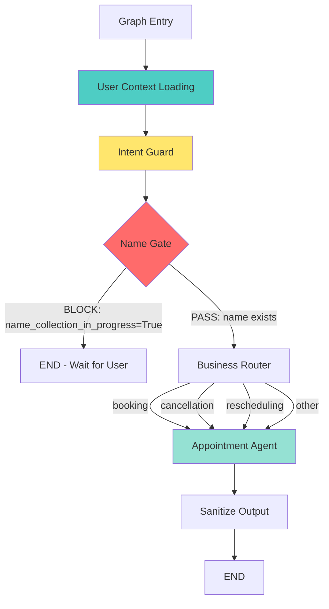

# LangGraph Architecture Documentation

**Last Updated**: 2026-02-24  
**Status**: Phases 1-6 Complete (Transactional Identity-First Architecture)

---

## Table of Contents

1. [Target Phase Diagram](#target-phase-diagram)
2. [Mental Model Principles](#mental-model-principles)
3. [Current vs. Target Architecture](#current-vs-target-architecture)
4. [Node Responsibility Matrix](#node-responsibility-matrix)
5. [State Lifecycle](#state-lifecycle)
6. [Migration Roadmap](#migration-roadmap)

---

## Target Phase Diagram

The target architecture enforces a **deterministic, identity-first IVR onboarding flow**:



### Flow Sequence

```
ENTRY 
  → USER_RESOLUTION (lookup/create user, set user_id)
  → INTENT_GUARD (classify intent, lock active_intent before name prompts)
  → NAME_GATE (blocking: BLOCK if name missing, PASS if name exists)
  → BUSINESS_ROUTER (route based on intent)
  → APPOINTMENT_AGENT (pure business logic, slot filling)
  → SANITIZE_OUTPUT (cleans and formats final AI response)
  → END
```

---

## Mental Model Principles

### 1. Infrastructure First
**User identity resolution must be Step 0**

- Phone number lookup happens at graph entry
- `user_id` is established before any other logic runs
- No intelligence (sentiment, intent) runs without identity

### 2. Name Gate as Hard Blocker
**Name validation is a blocking gate, not a suggestion**

- ALL flows must pass through the name gate
- If name is missing, graph BLOCKS (returns to user)
- No downstream nodes run until name exists
- Name gate has ONE job: decide BLOCK or PASS

### 3. Intent Context Before Gate Block
**Locking context immediately prevents transaction loss**

- Intent Guard runs *before* the Name Gate to ensure we capture the user's intent immediately.
- If the user provides a transactional intent (e.g., booking) but hasn't provided a name, the intent and `flow_step` are locked.
- After NameGate passes, the graph resumes the locked flow step seamlessly.
- Sentinel flags prevent intelligence from assuming fully onboarded state until Phase 4.

### 4. Graph Controls Flow
**Routing logic lives in the graph, not in nodes**

- Nodes execute logic and return state updates
- Graph uses conditional edges to route based on state
- Nodes don't decide "what comes next"

### 5. State Transitions Over Agents
**Think in state transitions, not "agents"**

- Onboarding is **infrastructure**, not AI logic
- Each node transitions state from one phase to another
- State fields have clear ownership and lifecycle

---

## Current vs. Target Architecture

### Current Implementation (Phase 6+)

**Entry Point**: `user_context_loading`

**Flow**:
```
user_context_loading 
  → intent_guard
  → name_enrichment (NAME GATE) 
  → business_router
  → appointment_agent 
  → sanitize_output
  → END
```

**Key Characteristics**:

| Aspect | Current State | Phase |
|--------|---------|-------|
| Entry Point | user_context_loading | Phase 2 |
| Intelligence Timing | Intent Guard runs right after Identity | Phase 4 |
| Name Gate | Hard blocker with escalating prompts | Phase 3 |
| Business Routing | Separate router node handles conditionals | Phase 5 |
| Output Pipeline | Dedicated Sanitize Output Node | Phase 6 |
| Overall Behavior | Deterministic, Identity-first, State-machine based | Phase 6 |

---

## Node Responsibility Matrix

| Node | Current Responsibilities | Target Responsibilities | Migration Phase |
|------|-------------------------|------------------------|-----------------|
| **Entry Point** | user_context_loading | user_context_loading | Phase 2 ✅ |
| **user_context_loading** | • User lookup/create<br>• Set user_id<br>• Set needs_name_enrichment flag | **Same** (no changes to logic) | Phase 2 ✅ |
| **intent_guard** | • Intent classification<br>• Lock transactional contexts<br>• Set active_intent | • Runs immediately after identity<br>• Guards state invariants | Phase 4 ✅ |
| **name_enrichment** | • Ask for name<br>• Extract name from response<br>• Update database | • Pure name gate<br>• Binary decision: BLOCK or PASS<br>• Escalating prompts | Phase 3 ✅ |
| **business_router** | • Route based on intent<br>• Pure logic | • Route based on active intent to appointment_agent | Phase 5 ✅ |
| **appointment_agent** | • Business logic<br>• Confirmations<br>• Transaction execution | • **Pure business executor**<br>• Tool calling only<br>• Strict deterministic slot filling | Phase 6 ✅ |
| **sanitize_output** | • Format TTS text | • Final node before END | Phase 6 ✅ |

### Critical Rules

> [!IMPORTANT]
> **Rule 1**: If `appointment_agent` checks `needs_name_enrichment`, the graph is wrong.

> [!IMPORTANT]
> **Rule 2**: If any node after name gate checks for user identity, the graph is wrong.

> [!IMPORTANT]
> **Rule 3**: Name gate must not know about intent or sentiment.

---

## State Lifecycle

State fields have clear ownership and lifecycle boundaries:

### Phase 1: Infrastructure State (Immutable After Population)

**Set Once, Never Modified**

| Field | Set By | Lifecycle |
|-------|--------|-----------|
| `caller_mobile_number` | Graph entry (entrypoint.py) | Immutable |
| `user_id` | user_context_loading | Immutable after set (must be != 0) |

**Invariant**: These fields are populated at graph entry and never change.

### Phase 2: Onboarding State (Used Only Until Name Gate)

**Consumed by Name Gate, Not Read After**

| Field | Set By | Cleared By | Read After Name Gate? |
|-------|--------|------------|----------------------|
| `user_profile` | user_context_loading | name_enrichment (enriched) | ✅ Yes (appointment agent) |
| `user_context_loaded` | user_context_loading | - | ✅ Yes (appointment agent) |
| `needs_name_enrichment` | user_context_loading | name_enrichment | ❌ No (target) |
| `name_collection_in_progress` | name_enrichment | name_enrichment | ❌ No (target) |

**Invariant**: Onboarding flags should not be read past the name gate in target architecture.

### Phase 3: Intelligence State (Set After Identity)

**Populated immediately after user_id resolution**

| Field | Set By | Used By |
|-------|--------|---------|
| `intent` | intent_guard | business_router, appointment_agent |
| `intent_confidence` | intent_guard | business_router, appointment_agent |

**Invariant**: These fields assume user identity is complete (user_id != 0).

### Phase 4: Business State (Throughout Conversation)

**Transactional Flow Tracking**

| Field | Managed By | Lifecycle |
|-------|------------|-----------|
| `messages` | All nodes | Append-only, never cleared |
| `active_intent` | intent_guard | Session intent for transactions |
| `intent_locked` | intent_guard | Boolean guard for locking context |
| `conversation_mode`| intent_guard | "idle" or "transaction" |
| `flow_step` | Intent/Agent | Tracks fine-grained slot state |
| `flow_completed` | appointment_agent | Marks end of transaction |
| `collected_slots` | appointment_agent | Preserves data during flow |

**Invariant**: Transaction fields are retained across messages to preserve context when invoking business routing.

---

## Migration Roadmap

### Phase 0: Stabilization ✅ COMPLETE

**Status**: ✅ Completed 2026-02-09

- [x] Add logging at graph entry/exit
- [x] Add debug logging for critical state fields
- [x] Add safety assertion in appointment_agent (user_id != 0)
- [x] Create test suites for Phase 0 changes

### Phase 1: Mental Model Documentation ✅ COMPLETE

**Status**: ✅ Completed 2026-02-09

- [x] Create GRAPH_ARCHITECTURE.md (this document)
- [x] Update workflow.py docstring
- [x] Update state.py docstring
- [x] Add mental model comments to all nodes

### Phase 2: Restructure Graph Entry ✅ COMPLETE

**Status**: ✅ Completed

- [x] Change `workflow.set_entry_point()` to `user_context_loading`
- [x] Remove sentiment_analysis and intent_detection from entry path
- [x] Ensure caller_mobile_number is mandatory at graph invocation
- [x] Update tests for new entry point

### Phase 3: Convert Name Enrichment to True Gate ✅ COMPLETE

**Status**: ✅ Completed

- [x] Rename conceptual role: name_enrichment → NameGate
- [x] Move all "did we ask already?" logic into NameGate
- [x] NameGate outputs: BLOCK (END) or PASS (continue)
- [x] Support restoring `flow_step` for intents locked before Name Gate
- [x] Implement escalating prompts for name collection

### Phase 4: Move Intent and Refactor Flow ✅ COMPLETE

**Status**: ✅ Completed

- [x] Remove sentiment_analysis entirely (simplification)
- [x] Position `intent_guard` immediately after identity loading
- [x] Lock transactional state (`active_intent`, `flow_step`) early
- [x] Ensure intent does not proceed without `user_id != 0`

### Phase 5: Introduce Business Router ✅ COMPLETE

**Status**: ✅ Completed

- [x] Add business_router_node (pure logic, no LLM)
- [x] Route based on `active_intent` or `intent`: booking, cancellation, reschedule
- [x] Map all standard actions to `appointment_agent`

### Phase 6: Slim Down Appointment Agent ✅ COMPLETE

**Status**: ✅ Completed

- [x] Remove name greeting logic and detection heuristics
- [x] Move strictly to tool calling, confirmation loops, slot validation
- [x] Implement deterministic slot checks and transaction execution
- [x] Add `sanitize_output` node directly after

### Phase 7: Simplify State Schema ✅ COMPLETE

**Status**: ✅ Completed

- [x] Classify state fields: infrastructure, onboarding, business
- [x] Ensure overarching invariant assertions at entry nodes
- [x] Implement strict field resets after flow completion
- [x] Define canonical flows via `FLOW_DEFINITIONS`

### Phase 8: Validation Against plan.md ✅ COMPLETE

**Goal**: Hard check against requirements

- [x] Phone number always resolves to user_id
- [ ] Name gate blocks ALL flows
- [ ] Intent detection never runs before onboarding
- [ ] Appointment creation never happens without name
- [ ] Cancel/reschedule always fetch appointments first

**Outcome**: Verified correctness

---

## References

- [plan.md](file:///home/root497/Inexture_Projects/Twilio-IVR/backend/docs/plan.md) - Original IVR system plan
- [restrucuting_plan.md](file:///home/root497/Inexture_Projects/Twilio-IVR/backend/docs/restrucuting_plan.md) - Phase-wise restructuring plan
- [workflow.py](file:///home/root497/Inexture_Projects/Twilio-IVR/backend/app/ai/graph/workflow.py) - Graph implementation
- [state.py](file:///home/root497/Inexture_Projects/Twilio-IVR/backend/app/ai/graph/state.py) - State schema
