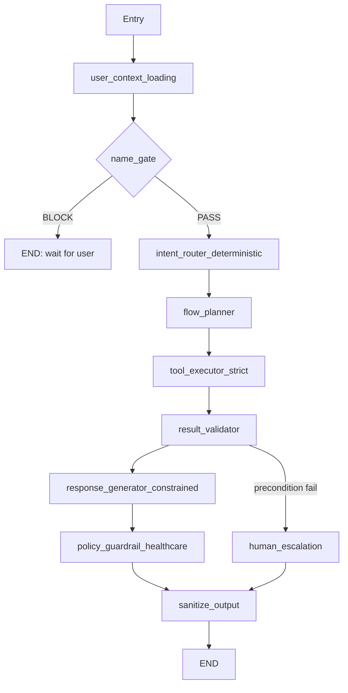

# LangGraph Production Architecture Review

**System**: Hospital Front Desk Conversational Agent (LangGraph Orchestration Layer)
**Scope**: Graph design, nodes, tool routing, memory/state, guardrails, validation, control flow, hallucination mitigation
**Primary Runtime**: LiveKit Voice Agent (STT → LangGraph LLMAdapter → TTS)
**Date**: 2026-02-25 (Revised)

---

## Executive Summary

The current LangGraph orchestration has a strong baseline architecture:

- Identity-first entry through `user_context_loading`
- Explicit Name Gate with blocking behavior
- Intent Guard with transactional locking fields
- Dedicated business router and output sanitization node
- Runtime safeguards for some transactional tool calls (cancel/reschedule ID verification)
- Forced tool invocation for cancellation/rescheduling appointment lookup

However, the implementation is **not yet near-zero hallucination** and is **not fully production-ready for hospital-grade voice deployment**.

The highest-impact gaps are:

1. **Hardcoded test phone number** in LiveKit agent worker allows identity impersonation.
2. **Stale module-level date/time** in tool validation will produce wrong results in the long-running voice worker process.
3. **`RuntimeError` in transactional guards** causes silent dead air on voice calls (no graceful recovery).
4. **Non-canonical flow step labels** break rescheduling confirmation context for the LLM.
5. **Safety invariants rely on Python `assert`**, which can be disabled in optimized runtimes.
6. **State/memory is process-local** (`InMemorySaver`, in-memory stores), limiting horizontal scaling and crash recovery.
7. **Tool grounding enforcement is partial** (stronger for cancel/reschedule, weaker for booking availability).
8. **LLM temperature 0.7** is applied uniformly to classification, extraction, and generation — too high for transactional healthcare.
9. **Hallucination confirmation guard** only covers booking, not cancellation or rescheduling.

Overall assessment:

- **Architectural direction**: Strong
- **Determinism and safety enforcement**: Partial
- **Production hardening level**: Medium-Low for healthcare voice deployment

---

## Current Architecture Assessment

### Graph Topology and Control Flow

Implemented graph in `backend/app/ai/graph/workflow.py`:

- `user_context_loading → intent_guard → name_enrichment → business_router → appointment_agent → sanitize_output → END`
- Name Gate routes to `END` when `name_collection_in_progress=True`.

Evidence:

- `workflow.add_edge("user_context_loading", "intent_guard")` (workflow.py:99)
- `workflow.add_edge("intent_guard", "name_enrichment")` (workflow.py:100)
- Name gate conditional edge (workflow.py:103-110)
- Business router conditional edge (workflow.py:113-119)
- Final sanitize path (workflow.py:121-122)

### LiveKit Voice Pipeline Integration

The production voice path is:

1. LiveKit SIP participant connects → `agent_worker.py:entrypoint()`
2. Caller number extracted from SIP attributes → `langgraph_adapter.py:create_langgraph_llm()`
3. Graph checkpointer pre-seeded with caller identity via `graph.update_state()`
4. `LLMAdapter` wraps compiled graph and translates LiveKit `ChatContext` ↔ LangChain messages
5. `AgentSession` orchestrates STT (Sarvam) → LLM (LangGraph) → TTS (Sarvam)

Evidence:

- agent_worker.py:78-161
- langgraph_adapter.py:26-99

### Node Responsibilities (as implemented)

- `user_context_loading_node`: resolves/creates user by mobile; sets `user_id`, `needs_name_enrichment`.
  - Evidence: user_context_node.py:32-191
- `intent_detection_node` (`intent_guard`): classifies intent, applies intent lock semantics.
  - Evidence: intent_detection_node.py:27-219
- `name_enrichment_node`: strict name collection gate and DB update.
  - Evidence: name_enrichment_node.py:90-255
- `business_router_node`: currently a deterministic pass-through router to `appointment_agent` for all intents.
  - Evidence: business_router_node.py:78-116
- `appointment_agent_node`: main LLM/tool loop and transactional logic.
  - Evidence: appointment_agent_node.py:221-839
- `sanitize_output_node`: keeps last `AIMessage` only, prevents context leakage to TTS.
  - Evidence: sanitize_output_node.py:29-69

### Determinism and Branching

Deterministic components:

- Graph edges and conditional routes are deterministic.
- Name gate block/pass routing is deterministic.

Non-deterministic components:

- Intent classification is LLM-based (`classify_intent_sync`).
- Slot extraction is LLM-based (`extract_slots_from_message`).
- Main dialog loop in `appointment_agent_node` depends on model behavior.
- All LLM calls use a shared `temperature=0.7` setting (config.py:62).

Evidence:

- classifier.py:184-242
- slot_extractor.py:26-82
- appointment_agent_node.py:462-657
- config.py:62

### Recursion/Loop Safety

- No graph-level recursive cycles were found.
- Main execution loop in `appointment_agent_node` has `MAX_TURNS = 5`.

Evidence:

- appointment_agent_node.py:458-463

### State Model and Invariants

State is structured with infrastructure/onboarding/business segments and transactional fields:

- `active_intent`, `intent_locked`, `flow_step`, `flow_completed`, `collected_slots`

Evidence:

- state.py:102-107

Validation currently uses `assert`-based invariants:

- `user_id != 0` for intelligence/business phases
- `needs_name_enrichment == False` for intelligence/business

Evidence:

- state.py:287-313

---

## Identified Bottlenecks

### Voice-Path Critical

1. **Hardcoded test phone number fallback in LiveKit worker**
   - `agent_worker.py:110-114`: When no SIP caller number is detected, the code falls back to a hardcoded test number (`"8799472801"`). ANY non-SIP connection (browser, playground) will silently impersonate this user's identity, giving access to their appointments and PHI.
   - Marked `TODO: Remove before production` but not enforced.
   - **Impact**: Identity impersonation, HIPAA/PHI violation in production.

2. **Stale module-level date/time constants in tool validation**
   - `appointment_tools.py:40-41`: `current_time` and `current_date` are computed once at module import, not per-request. The LiveKit agent worker is a long-running process; after midnight, these values become stale.
   - **Impact**: Past-date bookings accepted, valid future bookings rejected, incorrect availability checks.

3. **`RuntimeError` in transactional guards causes dead air**
   - `appointment_agent_node.py:500,511`: Guard failures for unverified appointment IDs raise `RuntimeError`. In the voice pipeline, this exception propagates through `LLMAdapter` into `AgentSession`, resulting in **complete silence** — no TTS output, no error message to the caller.
   - **Impact**: Caller hears nothing; call appears to hang.

4. **`Assistant.instructions` may conflict with LangGraph system prompts**
   - `agent_worker.py:62-65`: LiveKit's `Assistant` class defines its own `instructions` describing the agent persona. The `LLMAdapter` may pass these as context alongside the system prompts injected by `appointment_agent_node.py`, creating conflicting behavioral instructions.
   - **Impact**: Non-deterministic behavior when instructions disagree.

### Architectural

5. **Monolithic business execution node**
   - All intents route to one `appointment_agent`.
   - This centralizes complexity and increases coupling/risk.
   - Evidence: business_router_node.py:101-114

6. **Prompt-dependent behavior where runtime enforcement is needed**
   - Several critical safety behaviors are prompt instructions, not hard preconditions.
   - Evidence: appointment_prompts.py:35-47, 77-85, 102-111

7. **Brittle success detection for transaction completion**
   - Completion checks use string matching (`"successfully" in tool_output`).
   - A failure message containing "successfully" (e.g., `"Failed: was already successfully cancelled"`) could falsely trigger completion.
   - Evidence: appointment_agent_node.py:642-653

8. **State mutation inconsistency in flow control**
   - `collected_slots["flow_step"] = next_step` writes control metadata into the slot payload (line 819).
   - This creates two sources of truth: the `flow_step` variable and `collected_slots["flow_step"]`, which can diverge on error.
   - Evidence: appointment_agent_node.py:819

9. **Flow-step label inconsistency in rescheduling paths**
   - Uses non-canonical `"confirmation"` instead of `rescheduling__confirmation` (lines 636, 747).
   - `get_step_info()` returns `None` for `"confirmation"` since it doesn't exist in `FLOW_DEFINITIONS["rescheduling"]`.
   - **Impact**: No `prompt_hint`, `required_slot`, or progress info at the rescheduling confirmation step — LLM receives no guidance.
   - Evidence: appointment_agent_node.py:636, 747

10. **Error path drops transactional state fields**
    - On LLM invocation failure, function returns only `messages` without preserving control fields (`active_intent`, `flow_step`, etc.).
    - Evidence: appointment_agent_node.py:468-470

11. **Name gate DB failure branch builds message but does not return it**
    - `escalation_message` is created but omitted from returned state.
    - Additionally, the returned state preserves the old `name_prompt_level` instead of escalating, creating a silent retry loop.
    - Evidence: name_enrichment_node.py:216-223

12. **Bare `except: pass` swallows JSON parsing errors silently**
    - `appointment_agent_node.py:452`: After force-tool invocation, JSON parsing of appointment data fails silently. The `valid_appointment_ids` list stays empty, causing subsequent tool calls to hit the transactional guard and raise `RuntimeError`.
    - Evidence: appointment_agent_node.py:452

---

## Hallucination Risk Map

### High Risk

1. **Destructive action without hard confirmation gate**
   - Runtime guard checks missing non-confirmation slots, but confirmation is not enforced as mandatory before execution.
   - `REQUIRED_SLOTS_BY_INTENT` excludes `confirmed`.
   - Evidence: state.py:274-283; appointment_agent_node.py:521-557

2. **Booking availability assertions can be generated without hard tool proof**
   - Prompt says availability tools are mandatory, but runtime does not enforce evidence before availability claims.
   - Evidence: appointment_prompts.py:78-83; appointment_agent_node.py:475-476

3. **Hallucination confirmation guard only covers booking**
   - The anti-hallucination guard at lines 676-692 only fires when `active_intent == "booking"`.
   - Cancellation and rescheduling have **no equivalent guard**. If the LLM hallucinates "Your appointment has been cancelled" without the tool returning success, nothing blocks it.
   - Evidence: appointment_agent_node.py:676-692

4. **LLM temperature 0.7 for all operations**
   - A single `AI_TEMPERATURE=0.7` setting (config.py:62) is used for intent classification, slot extraction, name extraction, AND response generation.
   - For transactional healthcare, classification/extraction should use 0.0–0.1 for determinism.
   - Evidence: config.py:62; client_factory.py:55

### Medium Risk

5. **LLM-based intent and slot extraction with fallback defaults**
   - Failures default to inquiry/0.5; extraction relies on unconstrained text parser.
   - Evidence: classifier.py:236-242; slot_extractor.py:61-82

6. **Out-of-scope handling remains LLM-mediated**
   - Deterministic bypass exists for `inquiry` only, not for `greeting` or `out_of_scope`.
   - `greeting` with high confidence routes to `appointment_agent` with `GENERAL_AGENT_PROMPT` rather than a deterministic short-circuit.
   - Evidence: appointment_agent_node.py:317-337; intent_detection_node.py:166-171

7. **Confirmation anti-hallucination guard is phrase-based**
   - Applies only to booking and only by scanning response text for hardcoded phrases.
   - Evidence: appointment_agent_node.py:676-693

8. **Eager multi-slot extraction runs AFTER the LLM response**
   - The extraction block (lines 764-806) runs after the execution loop completes. The LLM may have already generated a response asking for a slot that was in the user's message. The extracted slots only affect the *next* invocation's flow step, but the current response will contain a redundant question.
   - Evidence: appointment_agent_node.py:764-806

### Low/Contextual Risk

9. **Name extraction is LLM-based and permissive**
    - Name gate may accept non-person entities if output contains letters.
    - Evidence: name_enrichment_node.py:326-330

10. **Duplicate intent override detection logic**
    - Override detection exists in two places with different implementations:
      - `intent_detection_node.py:86-98` — simple keyword unlock
      - `appointment_agent_node.py:119-196` — elaborate `_detect_intent_override()` with classifier confirmation
    - These can reach different conclusions for the same input.
    - Evidence: intent_detection_node.py:86-98; appointment_agent_node.py:119-196

---

## Tool Invocation Analysis

### What Works Well

1. **Forced initial tool for cancellation/rescheduling**
   - `get_upcoming_appointments` is force-invoked when needed.
   - Evidence: appointment_agent_node.py:408-452

2. **Appointment ID guard for destructive operations**
   - Blocks cancel/update if ID not verified/allowed.
   - Evidence: appointment_agent_node.py:489-511

3. **All-slots completeness guard before create/update**
   - Blocks tool execution and injects corrective tool error.
   - Evidence: appointment_agent_node.py:521-557

4. **Tool-level input validation**
   - `appointment_tools.py` validates date format, time format, future date/time, business hours, and slot granularity before execution.
   - Evidence: appointment_tools.py:219-354

### Gaps and Failure Modes

1. **No hard allowlist per `flow_step`**
   - Any model tool call is processed if present, regardless of current step.
   - Evidence: appointment_agent_node.py:479-571

2. **No strict structured tool result contract**
   - Tool results are parsed as strings; business logic depends on substring matching.
   - Evidence: appointment_tools.py (string responses throughout), appointment_agent_node.py:642-653

3. **Cancellation tool ignores the `reason` parameter**
   - `cancel_appointment_in_db` accepts a `reason` parameter but never passes it to `db_manager.cancel_appointment()`. The flow definition requires collecting a reason, but the value is discarded.
   - Evidence: appointment_tools.py:468-493

4. **`RuntimeError` used for guard failures instead of graceful recovery**
   - Transactional safety guard raises `RuntimeError` on ID mismatch or unverified ID.
   - In the voice pipeline, this crashes the turn with no user-facing fallback.
   - Evidence: appointment_agent_node.py:500, 511

5. **Bare `except: pass` after force-tool JSON parsing**
   - If `get_upcoming_appointments` returns malformed JSON (e.g., a DB error string), the valid IDs list stays empty, and all subsequent destructive tool calls will fail with `RuntimeError`.
   - Evidence: appointment_agent_node.py:452

6. **Prompt-only test coverage for critical fetch-first behavior**
   - Existing Phase 8 test checks prompt text heuristically, not runtime call enforcement.
   - Evidence: test_phase8_final_validation.py:123-137

### Recommended Enforcement Pattern

- Deterministic step router sets `allowed_tools` in state.
- Tool executor rejects any call not in `allowed_tools`.
- Destructive tools require verified preconditions:
  - `confirmed=True`
  - Verified `appointment_id`
  - Ownership match (`appointment_id` belongs to user)
- Use schema-first tool outputs (`success`, `error_code`, `payload`) instead of free text.
- Replace `RuntimeError` with injected `ToolMessage` errors that guide the LLM to recover.

---

## State & Memory Risks

### Short-Term Memory (Per Session)

Current mechanism:

- LangGraph checkpointer is `InMemorySaver`.
- LiveKit adapter pre-seeds state via `graph.update_state()`.

Evidence:

- workflow.py:84, 128
- langgraph_adapter.py:68-80

Risks:

1. **Not horizontally scalable** (process-local state).
2. **Not crash-resilient** (state lost on restart; active voice calls lose all context).
3. **Module-level singleton LLM model instances** — `appointment_agent_node.py` and `intent_detection_node.py` create LLM clients at import time. All concurrent LiveKit sessions share these instances. Thread safety of `ChatOpenAI`/`ChatGroq` under concurrent async invocation is Not Verified.
4. **`name_enrichment_node` creates a new LLM client per invocation** (`_extract_name_with_llm()` calls `create_llm_model()` on every name extraction attempt), which is wasteful and could hit rate limits.

Evidence:

- appointment_agent_node.py:77-85
- intent_detection_node.py:22
- name_enrichment_node.py:299

### Long-Term Memory

- Not Implemented / Not Evident:
  - Durable conversation memory store for orchestration state
  - Retention/TTL policy and replay-safe event sourcing

### State Contamination/Drift

- `messages` reducer is additive (`left + right`), while caller passes full history each invocation.
- This can cause message duplication growth and drift unless upstream invocation semantics avoid re-merge.

Evidence:

- state.py:16-29
- entrypoint.py:53-55

### Concurrency

- Not Implemented / Not Evident:
  - Per-thread/session lock around graph invocation
  - Idempotency guard for concurrent turn processing

### Database Manager Instantiation

- `appointment_tools.py:43` creates `db_manager = DatabaseManager()` at module level (singleton).
- `user_context_node.py:73` and `name_enrichment_node.py:183` create new `DatabaseManager()` instances per invocation.
- Connection safety under this mixed pattern is Not Verified.

---

## Structural Improvements for Zero-Hallucination Design

1. **Replace `assert` with explicit validation exceptions**
   - Convert `validate_state_invariants()` to raise typed runtime exceptions.
   - Ensure production behavior remains enforced regardless of Python optimization flags.

2. **Replace `RuntimeError` with graceful ToolMessage injection**
   - On guard failures, inject a `ToolMessage` error that tells the LLM to re-ask the user, rather than crashing the session.

3. **Planner/Executor split**
   - `flow_planner_node` (deterministic finite-state step progression)
   - `tool_executor_node` (strict allowlist + precondition checks)
   - `response_node` (language generation only from validated state)

4. **Per-operation LLM temperature**
   - Classification/extraction: `temperature=0.0`
   - Response generation: `temperature=0.3–0.5`

5. **Strict schemas everywhere**
   - Intent classifier output schema (structured JSON)
   - Slot extraction output schema (typed values)
   - Tool outputs (`success`, `code`, `payload`, `safe_user_message`)

6. **Response evidence gating**
   - Add `response_validation_node` that blocks outgoing commitments unless required evidence flags are true.
   - Extend the hallucination guard to cover cancellation and rescheduling (currently booking-only).

7. **State segregation**
   - Separate `control_state` from `collected_slots`.
   - Never write flow control fields into slot maps.

8. **Deterministic fallback policies**
   - For `greeting`, `inquiry`, and `out_of_scope`, use fixed templates and deterministic short-circuits. Currently only `inquiry` has this.

9. **Consolidate intent override detection**
   - Merge the two duplicate override detection paths (intent_detection_node keyword check + appointment_agent_node classifier-confirmed check) into a single deterministic mechanism.

---

## Recommended Refactored Graph Architecture

### Refactor Principles

1. **LLM is not the control plane**: planner decides next operation deterministically.
2. **Executor is non-negotiable**: only allowed tool calls run.
3. **Validator is mandatory**: no final response without evidence alignment.
4. **Escalation is explicit**: deterministic route for policy uncertainty and safety conflicts.
5. **Errors are recoverable**: guard failures inject corrective messages, never crash the session.

---

## Safety & Compliance Considerations (Healthcare Context)

### Safety Risks Found

1. **Hardcoded test phone number allows identity impersonation** (agent_worker.py:110-114).
   - Non-SIP connections bind to a real user's account silently.

2. **Potential premature execution of transactional actions** without hard confirmation gate.

3. **No explicit emergency/clinical risk detector** in orchestration path.

4. **Human transfer mentioned in prompts but not implemented** in graph topology.
   - name_enrichment_node prompt mentions transfer: name_enrichment_node.py:52-57
   - No implemented transfer tool/route in graph: workflow.py:89-122

5. **Cancellation reason collected but discarded** — audit trail incomplete.
   - appointment_tools.py:468-493 accepts `reason` but doesn't persist it.

### Required Constraints for Hospital Context

1. **Medical advice prohibition at orchestration level**
   - Block clinical reasoning responses by policy node, not prompt-only.

2. **Emergency escalation policy**
   - Detect emergency intent/keywords and route to immediate human operator protocol.
   - Not Implemented / Not Evident.

3. **Destructive operation hard checks**
   - Confirmed consent + ownership + current-state validity before DB mutation.

4. **Audit traceability**
   - Write immutable structured events for: intent classification, tool call requests, tool outcomes, guard failures, escalations.
   - Not Implemented / Not Evident as a dedicated audit subsystem.

5. **PHI-safe logging discipline**
   - Phone numbers are logged in multiple places (e.g., `user_context_node.py:121`, `appointment_tools.py:232`).
   - `mask_mobile_number()` exists in `appointment_tools.py` but is not consistently applied across all log sites.

---

## Production Readiness Checklist

| Area | Status | Notes |
|---|---|---|
| Identity-first graph entry | Implemented | `user_context_loading` is entry point |
| LiveKit caller identity | **BROKEN** | Hardcoded test number fallback in `agent_worker.py` |
| Tool validation date/time | **BROKEN** | Module-level stale timestamps in `appointment_tools.py` |
| Name gate blocking | Implemented (with bug) | DB-failure message return bug; silent retry loop |
| Deterministic routing | Partial | Router deterministic, but all intents map to one node |
| Forced tool usage where required | Partial | Strong for cancel/reschedule fetch; weak for booking availability |
| Runtime confirmation gate for destructive actions | Not Implemented | Prompt-level guidance exists, hard gate missing |
| Hallucination guard coverage | Partial | Booking only; cancel/reschedule unguarded |
| Structured tool/result contracts | Not Implemented | Free-text outputs; substring-based success detection |
| Graceful error recovery in guards | **BROKEN** | `RuntimeError` crashes session (dead air on voice calls) |
| Invariant enforcement robustness | Partial | Uses `assert` instead of runtime exceptions |
| LLM temperature per operation | Not Implemented | Uniform 0.7 for all calls |
| Durable distributed memory | Not Implemented | In-memory stores/checkpointer only |
| Concurrency safety per session | Not Evident | No explicit lock/idempotency guards |
| Flow step consistency | **BROKEN** | Non-canonical `"confirmation"` breaks rescheduling |
| Healthcare policy guardrails | Partial | Inquiry redirect exists; comprehensive policy node absent |
| Human escalation workflow | Not Implemented | Mentioned in prompts, not in graph |
| Auditability / compliance telemetry | Partial | Logging exists; dedicated audit model not evident |
| Cancellation reason persistence | **BROKEN** | Reason collected then silently discarded |
| LiveKit instruction conflict check | Not Verified | `Assistant.instructions` vs LangGraph prompts |

---

## Priority-Based Action Plan

### 🔴 P0 — Voice-Path Critical (Fix Before Any Production Deployment)

1. **Remove hardcoded test phone number fallback**
   - `agent_worker.py:110-114`: Replace with a reject/disconnect when no SIP caller number is present.
   - Risk: Identity impersonation, PHI exposure.

2. **Fix stale module-level date/time in tool validation**
   - `appointment_tools.py:40-41`: Move `current_time`/`current_date` computation inside each tool function, evaluated per-call.
   - Risk: Incorrect booking validation after midnight.

3. **Replace `RuntimeError` with graceful recovery in transactional guards**
   - `appointment_agent_node.py:500,511`: Instead of raising, inject a `ToolMessage` error that instructs the LLM to re-ask for appointment selection. Return a valid state with an error message.
   - Risk: Dead air / silent hang on voice calls.

4. **Fix non-canonical `"confirmation"` flow step for rescheduling**
   - `appointment_agent_node.py:636,747`: Change `"confirmation"` to `"rescheduling__confirmation"`.
   - Risk: LLM receives no guidance at rescheduling confirmation step.

5. **Fix bare `except: pass` after force-tool JSON parsing**
   - `appointment_agent_node.py:452`: At minimum, log the error and set an error state. Preferably, inject a ToolMessage error so the LLM can inform the user.
   - Risk: Cascading `RuntimeError` if JSON parsing fails.

### 🟡 P1 — High Priority (Required for Healthcare-Grade Safety)

6. **Replace all `assert` invariants with explicit runtime validation errors**
   - `state.py:287-313`: Convert `validate_state_invariants` to raise typed exceptions and route to error handling.

7. **Add hard confirmation precondition**
   - Before `create_appointment_in_db`, `cancel_appointment_in_db`, `update_appointment_in_db`, require validated `confirmed=True` in state.

8. **Extend hallucination guard to cover cancellation and rescheduling**
   - `appointment_agent_node.py:676-692`: Currently only checks booking. Add equivalent guards for cancel/reschedule intents.

9. **Lower LLM temperature for classification and extraction**
   - Use `temperature=0.0` for `classify_intent_sync` and `extract_slots_from_message`.
   - Use `temperature=0.3` for response generation.

10. **Introduce strict step-tool allowlist executor**
    - Reject tool calls outside current step's allowed set.

11. **Persist cancellation reason in tool**
    - `appointment_tools.py:468-493`: Pass `reason` through to `db_manager.cancel_appointment()`.

12. **Fix error path state preservation**
    - `appointment_agent_node.py:468-470`: On LLM invocation failure, return full transactional state fields (not just messages).

13. **Fix name gate DB failure — return the escalation message**
    - `name_enrichment_node.py:216-223`: Include `escalation_message` in returned state and escalate `name_prompt_level`.

### 🟢 P2 — Medium Priority (Production Hardening)

14. **Move state/checkpoints to durable shared store**
    - Replace `InMemorySaver` for production voice deployments.

15. **Split monolithic appointment node** into planner/executor/validator/response nodes.

16. **Enforce schema-based tool outputs** and stop substring-based success detection.

17. **Implement deterministic escalation path** to human operator for safety conflicts.

18. **Add ownership validation in DB mutation path** (`appointment_id` scoped to caller user).

19. **Consolidate duplicate intent override detection** into a single mechanism.

20. **Cache LLM model instance in `name_enrichment_node`** — currently creates a new `create_llm_model()` on every invocation.

21. **Verify/resolve `Assistant.instructions` vs LangGraph prompt conflict** in the LiveKit adapter path.

22. **Remove unused `create_react_agent` import** from `appointment_agent_node.py:21`.

23. **Fix `collected_slots["flow_step"]` state pollution** — separate control state from slot payload.

24. **Fix eager multi-slot extraction timing** — move slot extraction to run *before* the LLM response in `appointment_agent_node.py` so the agent doesn't ask redundant questions.

25. **Fix LLM Client Concurrency Safety** — refactor module-level `ChatOpenAI`/`ChatGroq` singletons to avoid thread-safety concerns under concurrent async LiveKit sessions.

26. **Unify DatabaseManager Instantiation** — resolve the mixed pattern of module-level vs per-invocation `DatabaseManager()` instances to ensure db connection safety.

27. **Implement Medical Advice Policy Guardrail** — implement an explicit orchestration-level node (`policy_guardrail_healthcare`) to block clinical reasoning natively.

### 🔵 P3 — Low Priority (Polish & Observability)

28. **Improve test rigor** — replace prompt-text heuristic checks with runtime assertions on tool call enforcement.

29. **Add deterministic short-circuits for `greeting` and `out_of_scope`** matching the existing `inquiry` pattern.

30. **Operational dashboards** — track guard-trigger frequency, tool failure classes, intent override rates, escalation rates.

31. **PHI-safe logging audit** — ensure `mask_mobile_number()` is applied consistently across all log sites.

32. **Documentation hygiene** — align docstrings/comments with actual graph order; remove stale phase comments.

33. **Implement Audit Traceability System** — write immutable structured events for intent classifications, tool execution requests, guard failures, and escalations.

34. **Tighten Permissive Name Extraction** — improve validator logic in `name_enrichment_node` to ensure it rejects non-person entities more robustly.

---

## Evidence Index (Files Reviewed)

### Core Graph
- `backend/app/ai/graph/workflow.py`
- `backend/app/ai/graph/state.py`
- `backend/app/ai/graph/entrypoint.py`
- `backend/app/ai/graph/flow_manager.py`

### Nodes
- `backend/app/ai/graph/nodes/user_context_node.py`
- `backend/app/ai/graph/nodes/intent_detection_node.py`
- `backend/app/ai/graph/nodes/name_enrichment_node.py`
- `backend/app/ai/graph/nodes/business_router_node.py`
- `backend/app/ai/graph/nodes/appointment_agent_node.py`
- `backend/app/ai/graph/nodes/sanitize_output_node.py`

### AI Components
- `backend/app/ai/prompts/appointment_prompts.py`
- `backend/app/ai/intent/classifier.py`
- `backend/app/ai/utils/slot_extractor.py`
- `backend/app/ai/llm/client_factory.py`

### Database & Tools
- `backend/app/database/tools/appointment_tools.py`
- `backend/app/database/manager.py`

### LiveKit Voice Pipeline
- `backend/app/livekit/agent_worker.py`
- `backend/app/livekit/langgraph_adapter.py`
- `backend/app/livekit/tts_utils.py`

### Configuration
- `backend/app/core/config.py`

### Tests
- `backend/tests/test_phase8_final_validation.py`
- `backend/tests/test_phase4_intelligence.py`
- `backend/tests/test_intent_locking.py`
- `backend/tests/test_transactional_flows.py`
- `backend/tests/test_phase5_router.py`
- `backend/tests/test_phase7_state_schema.py`
- `backend/tests/test_langgraph_structure.py`
