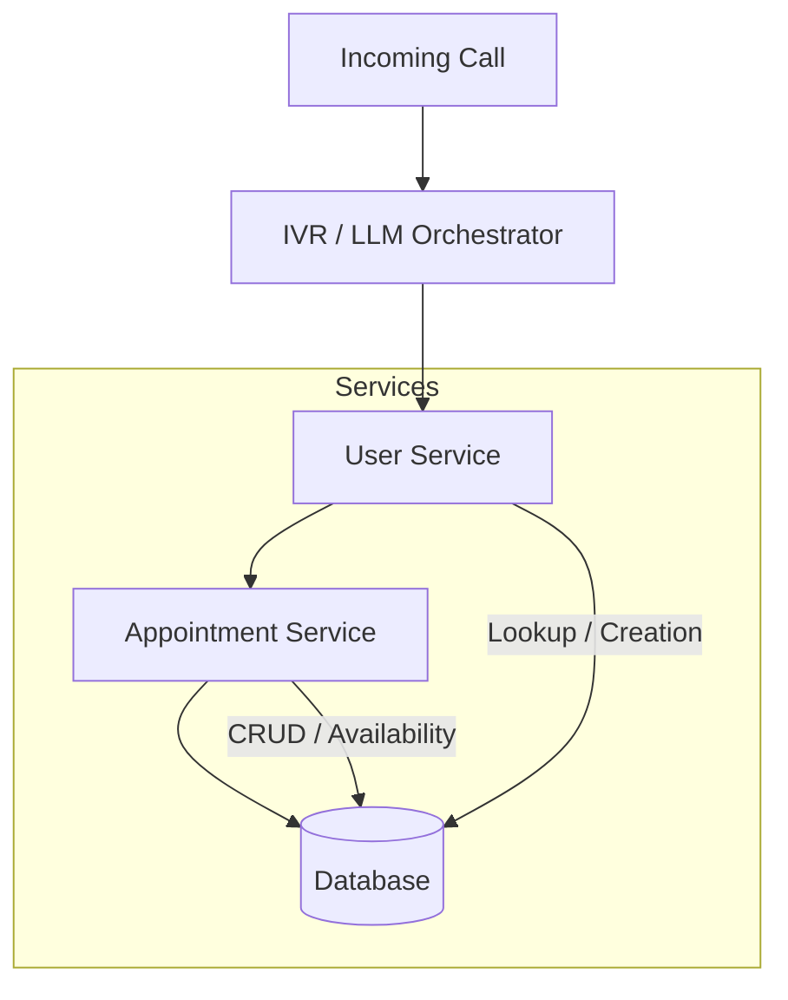
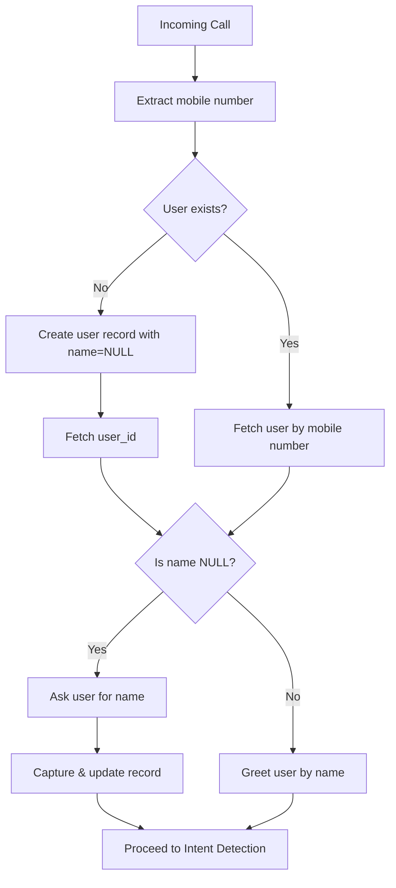
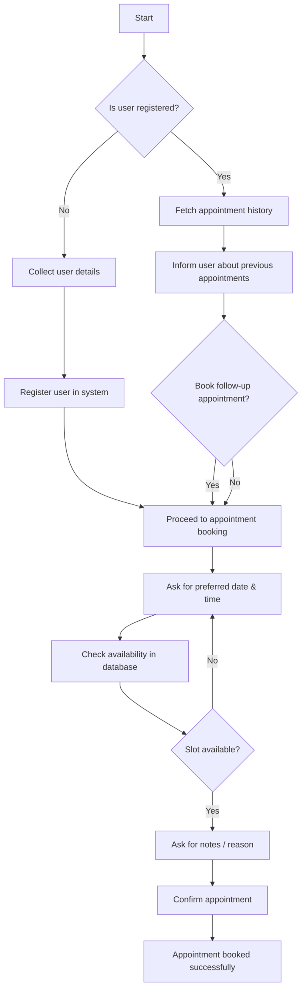
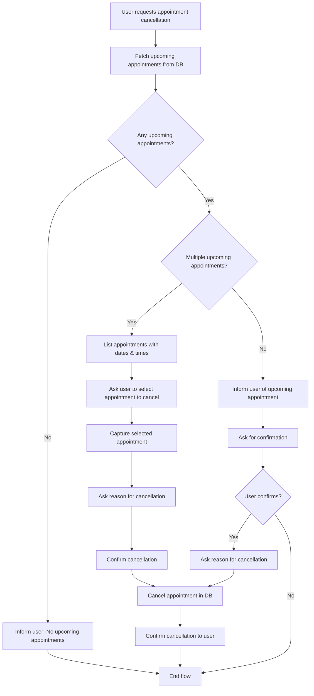
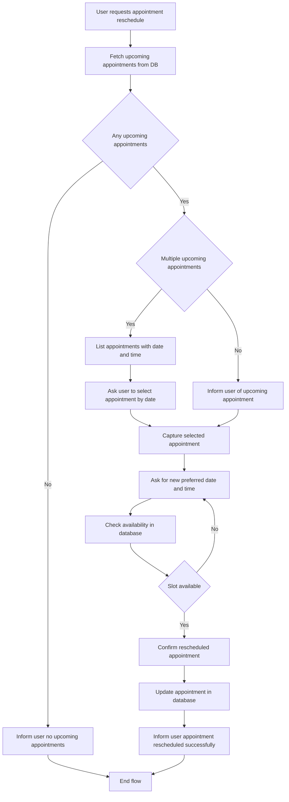

# IVR Appointment System Plan

## Table of Contents
1. [Objective](#1-objective)
2. [Core Design Principles](#2-core-design-principles)
3. [High-Level System Architecture](#3-high-level-system-architecture)
4. [Data Model](#4-data-model)
5. [Workflows](#5-workflows)
    - [User Onboarding](#51-user-onboarding-call-entry)
    - [Intent Detection & Routing](#52-intent-detection--routing)
    - [Appointment Booking](#53-appointment-booking)
    - [Appointment Cancellation](#54-appointment-cancellation)
    - [Appointment Reschedule](#55-appointment-reschedule)
6. [Error Handling & Edge Cases](#6-error-handling--edge-cases)
7. [Execution Order](#7-execution-order-recommended)
8. [Mental Model](#8-mental-model-to-keep-consistent)
9. [Long-Term Benefits](#9-what-this-enables-long-term)
10. [Diagrams](#10-diagrams)
11. [Next Steps](#11-next-steps)

---

## 1. Objective

Design and implement a phone-number–driven IVR appointment system that supports:
- **User onboarding** (New + Existing)
- **Appointment booking**
- **Appointment cancellation**
- **Appointment rescheduling**

**Key Requirements:**
- Work synchronously during a live call.
- Maintain strong data consistency.
- Be IVR-friendly (one question at a time).
- Be database-driven and deterministic.

---

## 2. Core Design Principles

### 2.1 Phone Number as Identity Anchor
- **Primary Lookup**: Mobile number is the primary lookup key.
- **Resolution**: Every call starts with a phone number resolution.
- **Unique ID**: `user_id` is generated once and reused everywhere.

### 2.2 Early User Creation, Progressive Enrichment
- **Immediate Creation**: User record is created immediately if not found.
- **Mandatory Capture**: Mandatory fields (like name) are captured during the conversation.
- **Blocking Flows**: Business flows never wait for post-call completion; they require necessary data upfront.

### 2.3 Unified Business Pipelines
- **Shared Booking Flow**:
  - New vs. Existing users
  - Regular vs. Follow-up appointments
- **Shared Discovery**: Cancel and reschedule flows share the same appointment discovery logic.

---

## 3. High-Level System Architecture

**State Management:**
Each service is stateless. State is maintained via:
- `call_sid`
- `user_id`
- Appointment IDs

---

## 4. Data Model

### 4.1 Users Table
| Column | Type | Constraints | Description |
| :--- | :--- | :--- | :--- |
| `user_id` | **UUID/INT** | **PK** | Unique identifier for the user. |
| `phone_number` | `VARCHAR` | `UNIQUE, NOT NULL` | Main identity anchor. |
| `name` | `VARCHAR` | `NULLABLE` | User's name. |
| `created_at` | `TIMESTAMP` | | Record creation time. |

### 4.2 Appointments Table
| Column | Type | Constraints | Description |
| :--- | :--- | :--- | :--- |
| `appointment_id` | **UUID/INT** | **PK** | Unique identifier for the appointment. |
| `user_id` | **UUID/INT** | **FK** | Links to `users` table. |
| `date` | `DATE` | | Appointment date. |
| `time` | `TIME` | | Appointment time. |
| `notes` | `TEXT` | | User notes or reason. |
| `status` | `ENUM` | `UPCOMING, CANCELLED` | Current status of the appointment. |
| `created_at` | `TIMESTAMP` | | Record creation time. |
| `updated_at` | `TIMESTAMP` | | Last update time. |

---

## 5. Workflows

### 5.1 User Onboarding (Call Entry)
**Trigger:** Incoming IVR call.

**Steps:**
1.  **Extract Mobile Number**: Get from call metadata.
2.  **Query Users Table**:
    -   **If User Exists:**
        -   Fetch `user_id`.
        -   Proceed to [Name Validation Gate](#name-validation-gate).
    -   **If User Does Not Exist:**
        -   Create user record with `phone_number` and `name = NULL`.
        -   Proceed to [Name Validation Gate](#name-validation-gate).

#### Name Validation Gate
*Mandatory for ALL users.*

1.  **Check Name**: Inspect the `name` field for the `user_id`.
2.  **Condition:**
    -   **If `NULL` or Empty:**
        -   **Prompt:** *"I see you're calling from this number, but I don't have your name yet. Who am I speaking with?"*
        -   **Action:** Capture input and update user record.
        -   **Next:** Proceed to Intent Detection.
    -   **If Name Exists:**
        -   **Prompt:** *"Hello [Name], welcome back."*
        -   **Next:** Proceed to Intent Detection.

**Guarantees:**
- Exactly one user record per phone number.
- `user_id` always exists before appointments are created.
- No duplicate users.

### 5.2 Intent Detection & Routing
Once onboarding is complete, determine intent:

> **Intent** $\in$ `{ Book Appointment, Cancel Appointment, Reschedule Appointment }`

*Routing is purely intent-based and independent of user type.*

### 5.3 Appointment Booking
**Entry Conditions:** User is onboarded AND `user_id` is known.

**Steps:**
1.  **Greeting**: *"Alright [Name], let's get that booked. What date and time were you thinking?"*
2.  **Availability Check**: Query Database.
    -   **Unavailable**: Re-prompt for date and time.
    -   **Available**:
        1.  Ask for notes/reason.
        2.  **Confirm**: *"Got it, [Name]. I've scheduled that for [Date] at [Time]. See you then!"*
        3.  **Action**: Create appointment record.

**Key Rules:**
- Availability check is mandatory.
- Appointment is created **only** after confirmation.

### 5.4 Appointment Cancellation
**Entry Conditions:** User requests cancellation.

**Steps:**
1.  **Fetch Appointments**: Get upcoming appointments for `user_id`.
2.  **Condition:**
    -   **None**: Inform user and exit.
    -   **One**:
        -   Inform details.
        -   Ask for confirmation.
        -   Ask for reason.
        -   **Action**: Update status to `CANCELLED`.
    -   **Multiple**:
        -   List appointments (dates/times).
        -   Ask user to select one.
        -   Ask for reason.
        -   **Action**: Update status to `CANCELLED` for selected appointment.

**Note**: Do not delete records; only update status.

### 5.5 Appointment Reschedule
**Entry Conditions:** User requests reschedule.

**Steps:**
1.  **Fetch Appointments**: Get upcoming appointments for `user_id`.
2.  **Condition:**
    -   **None**: Inform user and exit.
    -   **One**: Proceed to reschedule logic.
    -   **Multiple**: List appointments and ask user to select one.
3.  **Reschedule Logic**:
    -   Ask for **new** date and time.
    -   **Check Availability**:
        -   **Unavailable**: Re-prompt.
        -   **Available**:
            -   Confirm change.
            -   **Action**: Update appointment record with new date/time.

---

## 6. Error Handling & Edge Cases

| Scenario | Handling Strategy |
| :--- | :--- |
| **Call Drop Mid-Flow** | User is already in DB. No orphan appointments are created. Safe to retry on next call. |
| **Duplicate Calls** | Phone number uniqueness prevents duplication. User lookup is idempotent. |
| **Ambiguous Responses** | Always ask one question at a time. Re-prompt on unclear input. |
| **Interrupted Onboarding** | If user hangs up before giving name: Name remains `NULL`. Next call triggers [Name Validation Gate](#name-validation-gate) immediately. |

---

## 7. Execution Order (Recommended)

1.  **Phase 1 – Foundation**
    -   User table schema.
    -   Phone number lookup logic.
    -   User creation + name capture flow.
2.  **Phase 2 – Booking**
    -   Availability checks.
    -   Appointment creation logic.
3.  **Phase 3 – Cancellation**
    -   Fetch upcoming appointments.
    -   Handle single vs. multiple appointment scenarios.
4.  **Phase 4 – Rescheduling**
    -   Shared appointment discovery.
    -   Slot validation loop.

---

## 8. Mental Model to Keep Consistent

> 1.  **Onboarding** creates identity.
> 2.  **Booking** modifies state.
> 3.  **Cancellation & Rescheduling** operate on existing state.

---

## 9. What This Enables Long-Term

- **Multi-channel reuse**: Same logic for WhatsApp, Web, App.
- **Analytics**: Per-user tracking and history.
- **Follow-up reminders**: Easy to query upcoming appointments.
- **Audit-safe**: Full lifecycle visibility.

---

## 10. Diagrams

### 10.1 User Onboarding

### 10.2 Appointment Flow

### 10.3 Cancel Appointment

### 10.4 Appointment Reschedule

---

## 11. Next Steps

To operationalize this plan:

- [ ] **Convert into LangGraph states**
- [ ] **Convert into API contracts**
- [ ] **Create Task Breakdown for Jira**
- [ ] **Validate against Twilio IVR constraints**
